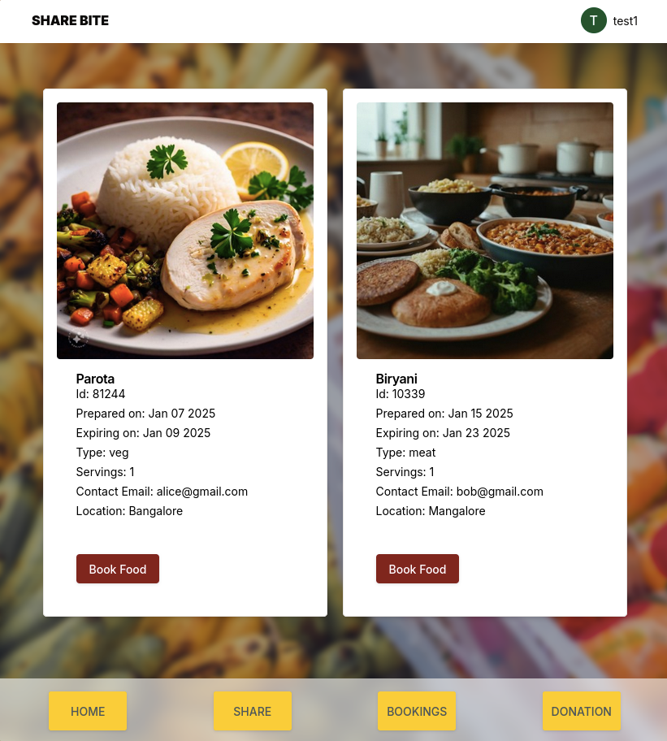

# Share Bite 🌮: Tackling Food Waste, One Bite at a Time  

  

## Video
[Click here to watch the video](https://drive.google.com/file/d/10R-t37lEyPoZnBpOSkEA6rmE4enzE8-T) 

## Overview  
Food waste is a significant global issue, with excess food being one of its primary causes. To address this problem, **Share Bite** provides a platform where individuals can share their excess food with those in need. This app/website aims to reduce food waste while fostering a spirit of community and generosity.

## How It Works  

### 1. Post Excess Food  
Users can upload posts about their excess food. Each post includes:  
- A **picture** of the food.  
- A **title** describing the food.  
- **Date and time** of creation.  
- **Expiry date** to indicate freshness.  
- **Type of food** (e.g., vegetarian, non-vegetarian, snacks, etc.).  
- **Quantity** available.
- **Location** location

### 2. View and Book  
- All uploaded posts are visible to users on the platform.  
- Users can browse the available posts and **book** the food they are interested in.  

### 3. Pick Up  
- After booking, users can visit the specified location to **pick up** the food.  

## Key Features  
- **Completely Free**: The platform is free for all users, promoting accessibility for everyone.  
- **User-Friendly Interface**: A simple and intuitive design ensures ease of use.  
- **Community-Centered**: Encourages sharing, reducing food waste, and helping those in need.  

## Tech Stack  
- **Frontend & Backend**: [Next.js](https://nextjs.org/) for building the web application and API.  
- **App Conversion**: [Capacitor.js](https://capacitorjs.com/) for converting the web application into a mobile app.  
- **Database**: [Redis](https://redis.io/) for efficient and fast data storage.  

## Purpose  
**Share Bite** is not just a platform; it’s a movement to minimize food waste and assist individuals in need. By sharing surplus food, we can make a significant impact in our communities.  

Let’s work together to tackle food waste, one bite at a time!  
